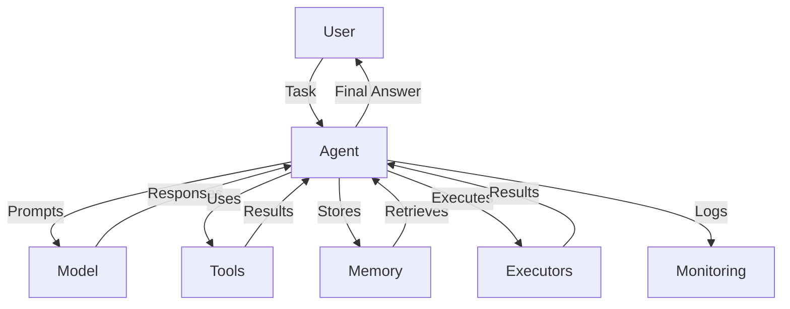
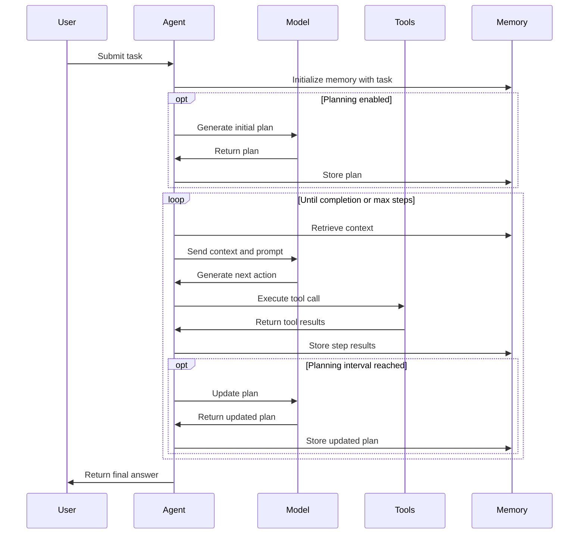
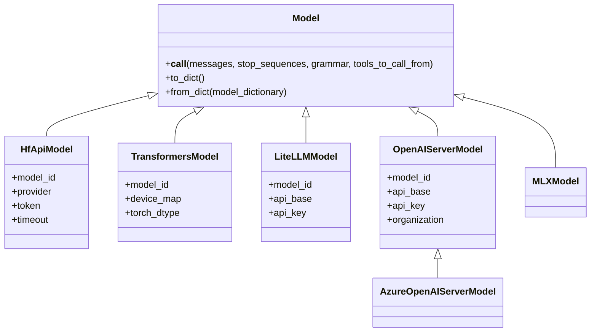
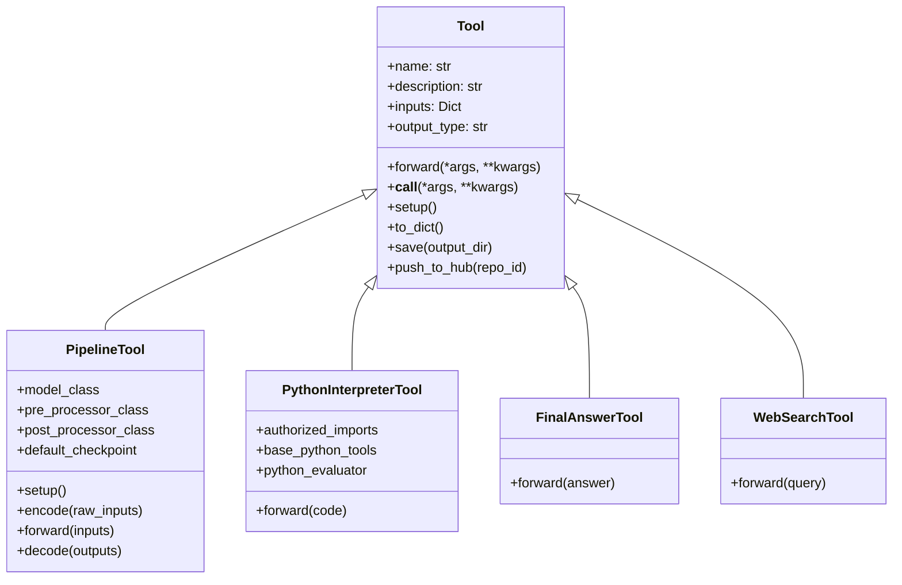
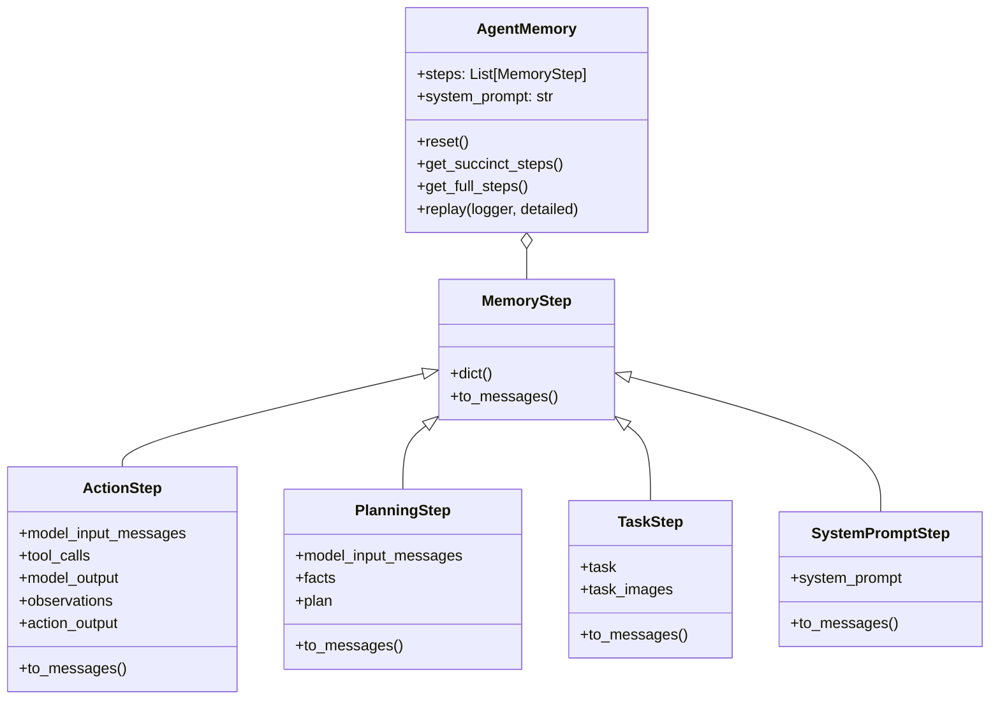
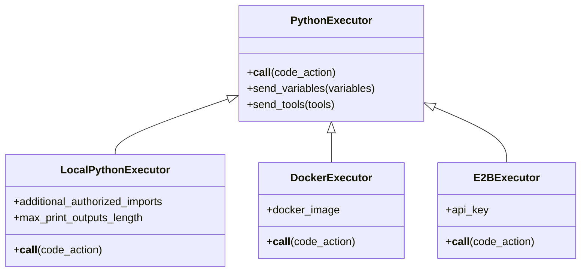
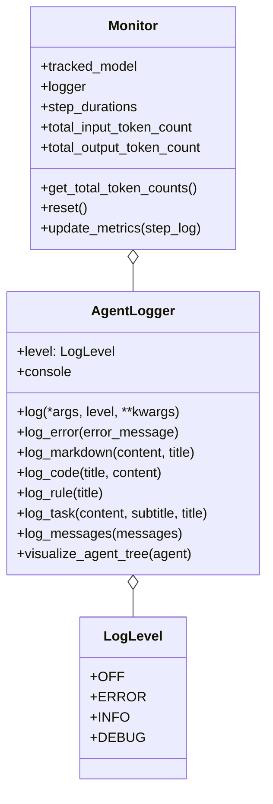
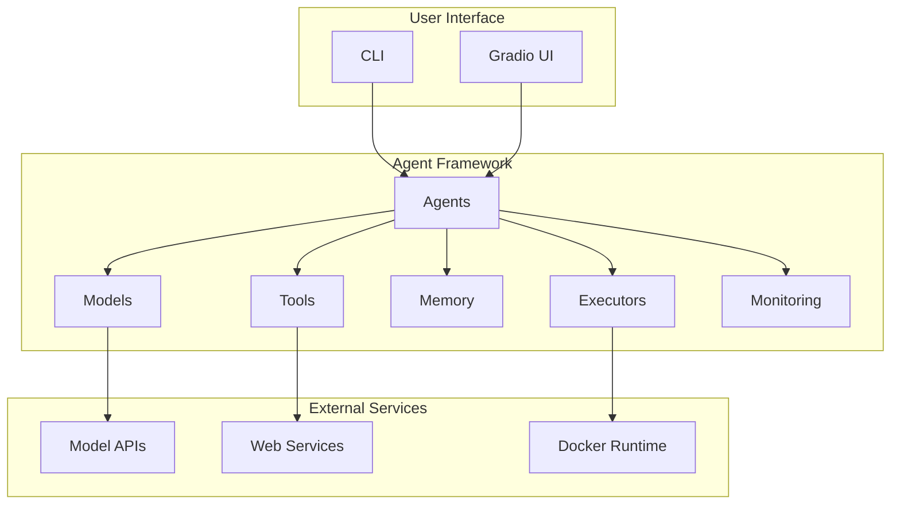
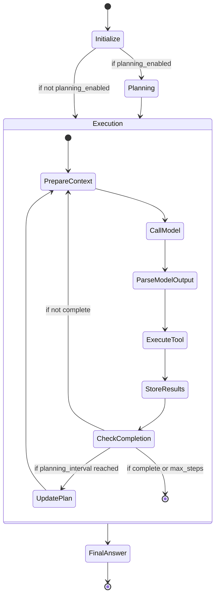

# SmolaGents Architecture Documentation

This document provides a comprehensive overview of the SmolaGents framework architecture, explaining the core components, their relationships, and how they work together to create powerful AI agents.

## Table of Contents

1. [Overview](#overview)
2. [Core Components](#core-components)
3. [Agent Types](#agent-types)
4. [Models](#models)
5. [Tools](#tools)
6. [Memory and State Management](#memory-and-state-management)
7. [Code Execution](#code-execution)
8. [Monitoring and Logging](#monitoring-and-logging)
9. [Architecture Diagrams](#architecture-diagrams)
10. [Extension Points](#extension-points)

## Overview

SmolaGents is a framework for building AI agents that can perform complex tasks by breaking them down into smaller steps, using tools, and maintaining memory of previous actions. The framework is designed to be modular, extensible, and easy to use.

At a high level, SmolaGents consists of:
- **Agents**: The core entities that process tasks and make decisions
- **Models**: LLM interfaces that provide the reasoning capabilities
- **Tools**: Functions that agents can use to interact with the world
- **Memory**: Storage for agent state and history
- **Executors**: Components that run code or other operations
- **Monitoring**: Systems for tracking agent behavior and performance



## Core Components

### Agents (`agents.py`)

Agents are the central components that orchestrate the entire process. The main agent classes are:

- **MultiStepAgent**: The base agent class that implements the core agent loop
- **ToolCallingAgent**: Specialized for tool usage with structured outputs
- **CodeAgent**: Specialized for generating and executing code

Agents follow a step-based execution model:
1. Receive a task
2. Plan how to approach the task (optional)
3. Execute steps by calling the model and using tools
4. Provide a final answer



### Agent Types (`agent_types.py`)

The framework defines special types for agent inputs and outputs:

- **AgentType**: Base class for agent-specific types
- **AgentText**: For text outputs
- **AgentImage**: For image outputs
- **AgentAudio**: For audio outputs

These types provide consistent handling of different data modalities across the framework.

## Models (`models.py`)

Models provide the reasoning capabilities for agents. The framework supports multiple model backends:

- **Model**: Base class for all models
- **HfApiModel**: Uses the Hugging Face API
- **MLXModel**: Uses MLX for local inference
- **TransformersModel**: Uses the Transformers library
- **LiteLLMModel**: Uses LiteLLM for various API providers
- **OpenAIServerModel**: Uses OpenAI's API
- **AzureOpenAIServerModel**: Uses Azure OpenAI's API

Models handle:
- Converting agent messages to the format expected by the model provider
- Managing tool definitions for function calling
- Processing model responses into a standardized format



## Tools (`tools.py`, `default_tools.py`)

Tools are functions that agents can use to interact with the world. The framework provides:

- **Tool**: Base class for all tools
- **PipelineTool**: Specialized for Transformer pipelines
- **Default tools**: Built-in tools like web search, Python interpreter, etc.

Tools have:
- A name and description
- Input schema
- Output type
- Implementation logic

Tools can be:
- Created from functions using the `@tool` decorator
- Loaded from the Hugging Face Hub
- Created from Gradio or LangChain tools



## Memory and State Management (`memory.py`)

Memory components store the agent's state and history:

- **AgentMemory**: Manages the agent's memory
- **MemoryStep**: Base class for memory steps
- **ActionStep**: Represents a tool execution step
- **PlanningStep**: Represents a planning step
- **TaskStep**: Represents a task definition step
- **SystemPromptStep**: Represents a system prompt step

Memory is used to:
- Store the history of agent actions
- Provide context for the model
- Enable replay and visualization of agent execution



## Code Execution (`local_python_executor.py`, `remote_executors.py`)

The framework provides several ways to execute code:

- **PythonExecutor**: Base class for Python code execution
- **LocalPythonExecutor**: Executes Python code locally with safety constraints
- **DockerExecutor**: Executes code in a Docker container
- **E2BExecutor**: Executes code using the E2B service

The code execution system:
- Parses and evaluates Python code safely
- Provides a sandboxed environment
- Limits imports and operations for security
- Captures outputs and errors



## Monitoring and Logging (`monitoring.py`)

The framework provides monitoring and logging capabilities:

- **Monitor**: Tracks agent metrics like token usage and step duration
- **AgentLogger**: Provides logging with different verbosity levels
- **LogLevel**: Defines logging verbosity levels

Monitoring helps:
- Track agent performance
- Debug agent behavior
- Visualize agent execution



## Architecture Diagrams

### High-Level Component Interaction



### Agent Execution Flow



## Extension Points

SmolaGents is designed to be extensible. Key extension points include:

1. **Custom Agents**: Create new agent types by subclassing `MultiStepAgent`
2. **Custom Tools**: Create new tools by subclassing `Tool` or using the `@tool` decorator
3. **Custom Models**: Support new model providers by subclassing `Model`
4. **Custom Executors**: Create new execution environments by subclassing `PythonExecutor`
5. **Custom Prompt Templates**: Customize agent behavior with custom prompt templates

To extend the framework:

```python
# Create a custom tool
from smolagents.tools import Tool

class MyCustomTool(Tool):
    name = "my_custom_tool"
    description = "Does something amazing"
    inputs = {"input": {"type": "string", "description": "Input description"}}
    output_type = "string"
    
    def forward(self, input: str) -> str:
        # Implementation
        return result

# Create a custom agent
from smolagents.agents import MultiStepAgent

class MyCustomAgent(MultiStepAgent):
    def initialize_system_prompt(self) -> str:
        # Custom system prompt
        return "You are a specialized agent that..."
    
    def step(self, memory_step):
        # Custom step implementation
        # ...
```

This architecture document provides a high-level overview of the SmolaGents framework. For more detailed information, refer to the source code and documentation. 